# M.A.Ge - your automated menu generator

An Android app written in python using [Kivy](https://kivy.org/#home) and [KivyMD](https://github.com/kivymd/KivyMD) to generate menu for 1 day/week/month. The app is available on [Amazon Appstore](https://www.amazon.de/gp/product/B09YYXN35D)

Everyday most of us have a problem "What to prepare for breakfast, lunch or dinner?" This app easily helps you to plan a daily/weekly/monthly menu. It is easy to setup, without nutrition plans and calorie counting.

### "Menu"
My app has a Navigation drawer with only three destinations, first loaded screen is 'Menu'. In 'Menu' you can generate a menu based on your settings. It has big images, so you can easily visualise your meal and refresh your memory on the preparation instructions.

  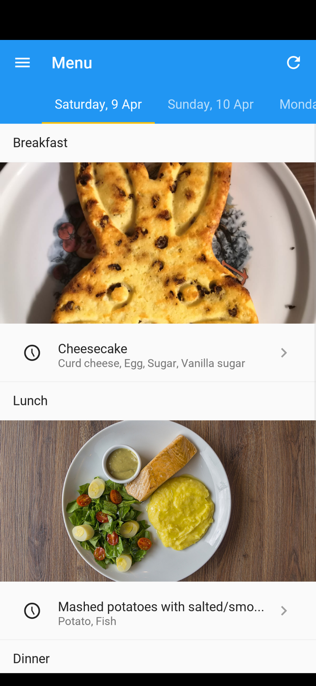
  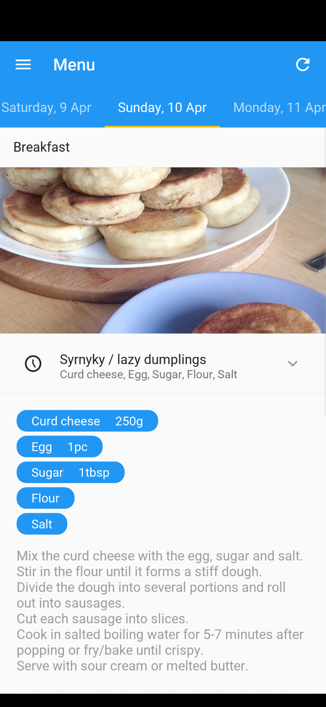

### "Settings"
In 'Settings' you can set time period, meal types and some rules. There are only four rules:
- You can set nutrients for each meal type, e.g. only carbs for breakfast and protein for dinner, veggies for all meal types. 
- You can set preparation time for each day, e.g. on Mo-Fr get meals with short preparation time, as you have work. 
- You can discard some meals, e.g. every Su you have a lunch at the restaurant, so no meal is needed
- You can set tags for each meal type, e.g. for breakfast get only recipes with 'breakfast' tag, so there will be no soup so early

  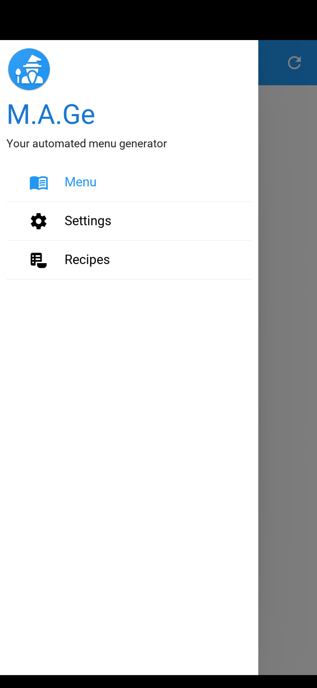
  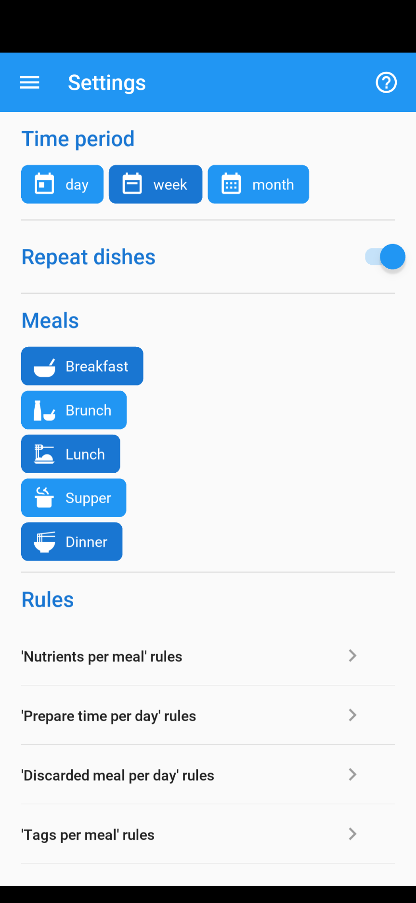
  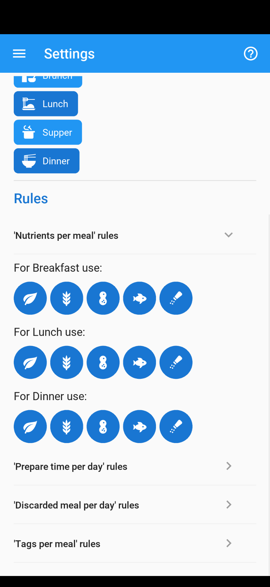
  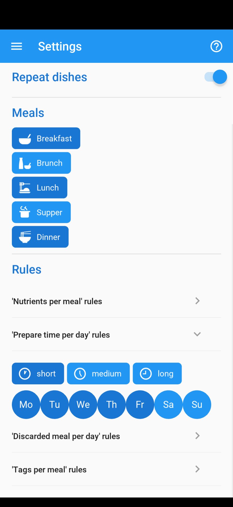
  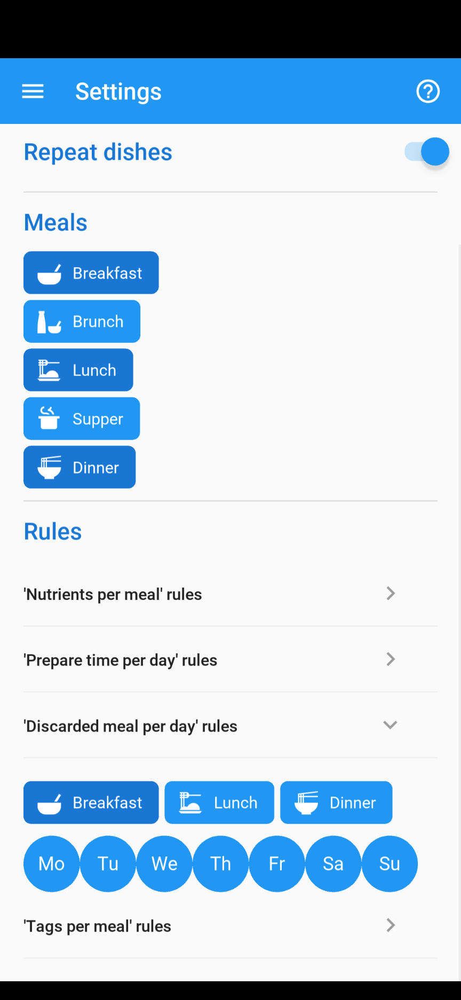
  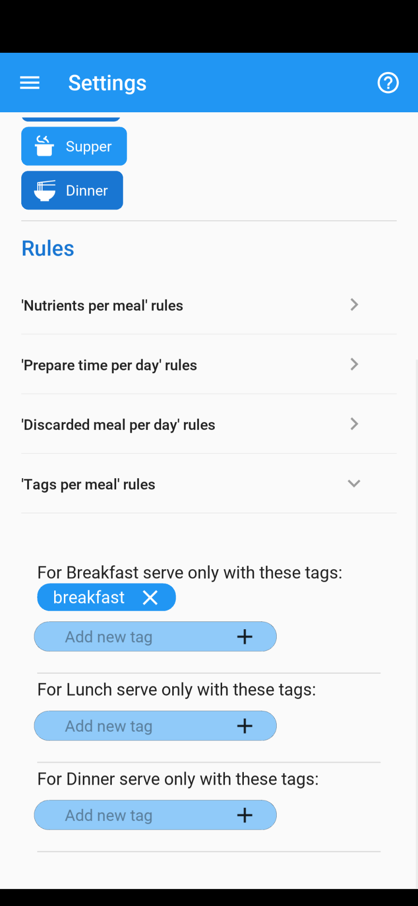

### "Recipes"
In 'Recipes' you can view, edit, create or delete recipes. 64 basic recipes of Eastern European cuisine are already included.

  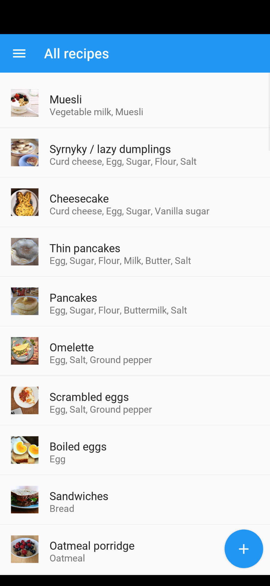
  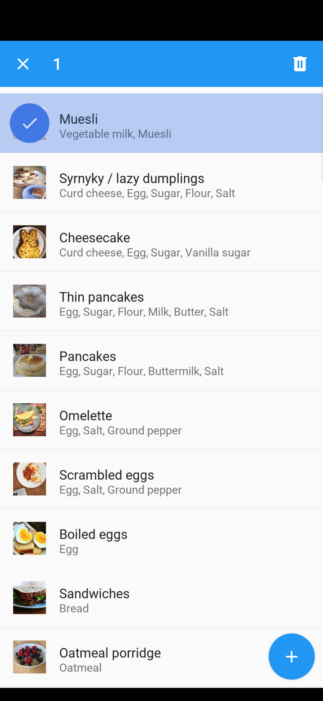

### "Add/Edit Recipe"
Images can be taken with camera or chosen from the gallery, for this purpose [Plyer](https://github.com/kivy/plyer) is used. For each recipe you can add ingredients and tags, select preparation time and mark recipe for 'repeat', so the recipe can be used on two consecutive days.

  
  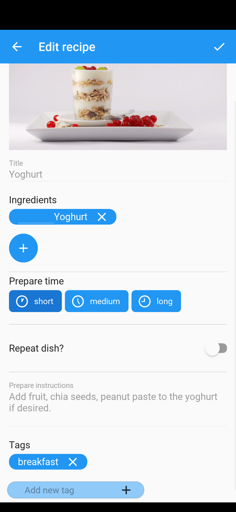
  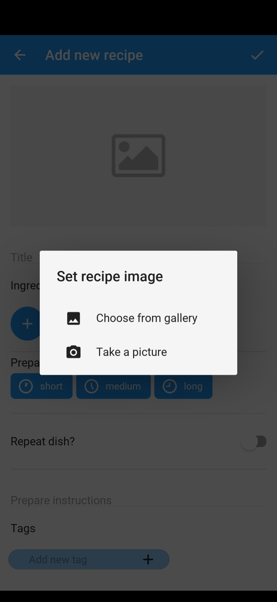
  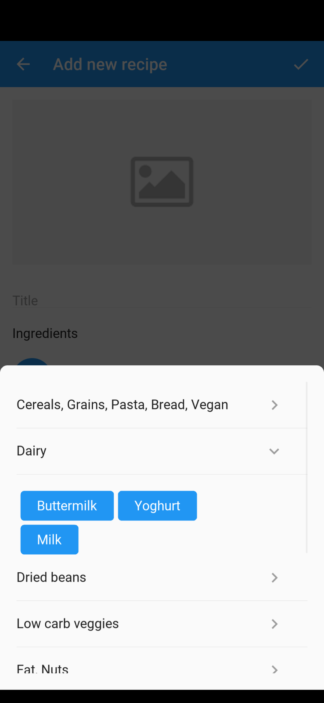
  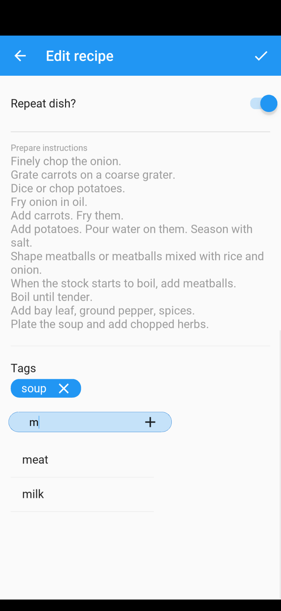

When app is installed it has only these rules:
- [x] prepare time rules
  - short prepareTime on Wednesday, Friday, Monday, Tuesday, Thursday
  - long prepareTime on Saturday, Sunday
  - medium prepareTime on Monday, Tuesday, Wednesday, Thursday, Friday, Saturday, Sunday
- [x] tags per meal rules
  - At Breakfast serve only breakfast
  - At Lunch serve only ''
  - At Brunch serve only ''
  - At Supper serve only ''
  - At Dinner serve only ''
- [x] nutrients per meal rules
  - For Breakfast use high_carb, protein, free, low_carb, fat
  - For Lunch use low_carb, high_carb, protein, fat, free
  - For Dinner use high_carb, protein, free, low_carb, fat
  - For Brunch use low_carb, protein, high_carb, fat, free
  - For Supper use low_carb, protein, high_carb, fat, free
- [x] discard meal rules    
  - On '' discard Lunch
  - On '' discard Breakfast
  - On '' discard Brunch
  - On '' discard Supper
  - On '' discard Dinner

Under the hood application uses these rules:
- [x] ignore nutrient rules 
  - For ignoreProtein ignore protein
  - For ignoreHighCarb ignore high_carb
  - For ignoreLowCarb ignore low_carb
  - For ignoreFat ignore fat
- [x] food class as nutrient rules
  - cereals,grains,pasta,bread,vegan is high_carb
  - dried_beans is high_carb
  - fat,nuts is fat
  - fruits is high_carb
  - high_carb_veggies is high_carb
  - low_carb_veggies is low_carb
  - meat,fish,cheese,eggs is protein
  - dairy is low_carb, protein, fat
  - other_seasoning is free

I also plan to add more improvements, such as:
- [ ] I can eat one main dish with different sidedishes
- [ ] often I need to cook several sidedishes because not all family members eat the same

### Inspiration resources

I have read a wonderful article ["Wizards and warriors"](https://ericlippert.com/2015/04/27/wizards-and-warriors-part-one/) and post on [Stackoverflow](https://stackoverflow.com/questions/55226942/python-how-to-to-make-set-of-rules-for-each-class-in-a-game). It helped me, because primarly I intended to make class hierarchies and express rules by writing code inside methods. In the article author described a system, where rules are data, not code, and finds it to be more flexible. So I decided to give it a try.
