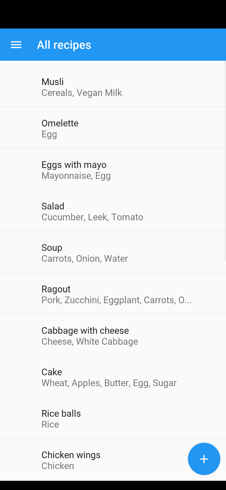

# menuGenerator
An Android app written in python using [Kivy](https://kivy.org/#home) and [KivyMD](https://github.com/kivymd/KivyMD) to generate menu for 1 day/week/month.

The app now has almost all important functionality and now I need to create a package for Android: 
- [x] install Ubuntu
- [x] install kivy, kivymd and their dependencies
- [x] install Buildozer 
- [ ] make a package
- [ ] install package on Android
- [ ] test app

My app has a Navigation drawer with only three destinations, first loaded screen is "Menu":

  
  

In "Settings" user can select time period of generated menu, what meals per day are included and if dishes can be prepared for several days. Rules part will be implemented later:

  

In "All Recipes" user can view all recipes in a list, on long click can select and delete selected recipes, with a click on "Plus" add a new recipe:

  
  

When user wants to edit recipe or create a new one, forth screen opens, here user can add picture, choose ingredients and add existing tags or create new ones:

  
  
  
  

Under the hood application uses Rules:
- [x] on Working days I don't have much time for cooking
- [x] at weekend I can prepare dishes with long cooking time
- [x] only at breakfast I eat 'breakfast' dishes
- [x] at breakfast I eat low- or no-protein food
- [x] at lunch I eat all
- [x] at dinner I eat low- or no-carb food
- [x] on Sunday at breakfast I eat thin or thick pancakes
- [x] on Sunday at lunch I order food at the restaurant
- [x] I can eat same main dish for several days
- [x] no same dishes in one day
- [ ] I can eat one main dish with different sidedishes
- [ ] often I need to cook several sidedishes because not all family members eat the same

### My initial thoughts

There are many ways to generate a menu. One can try MIP (mixed-integer programming) or genetic algorithm. See articles about PuLP [one](https://towardsdatascience.com/roster-optimization-using-python-85b26d58e806) and [two](https://www.pythonstart.com/solving-linear-programming-problems-in-python-with-pulp)

I have read a wonderful article ["Wizards and warriors"](https://ericlippert.com/2015/04/27/wizards-and-warriors-part-one/) and post on [Stackoverflow](https://stackoverflow.com/questions/55226942/python-how-to-to-make-set-of-rules-for-each-class-in-a-game). It helped me, because primarly I intended to make class hierarchies and express rules by writing code inside methods. In the article author described a system, where rules are data, not code, and finds it to be more flexible. So I decided to give it a try.
